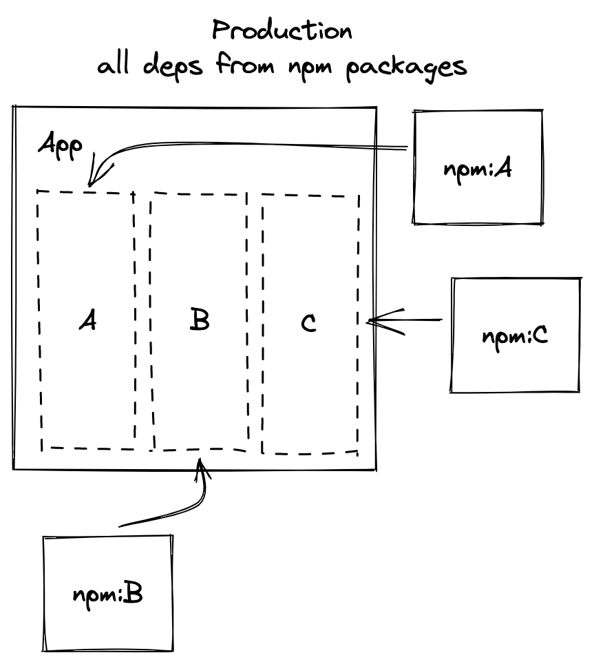
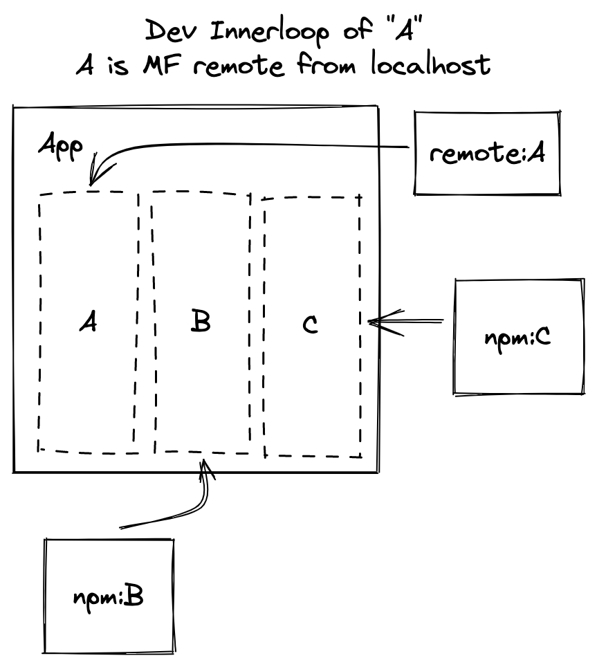

# Sidecar Webpack Plugin

This is a Webpack 5 plugin that leverage the use of module federation (MF) and various conventions to easily provide and consume code in a way that is:

1. sidecar-like: functionality of the sidecar packages is behind what is defined in the package.json's "exports" field
2. local first: prefers the npm installed implementation
3. remote sidecar: leverages MF to load the code from a location defined at runtime

## Overview

  



## Sidecar-Like

The provider package

# Contributing

### How to test this out?

```
yarn
yarn build
yarn start
```


